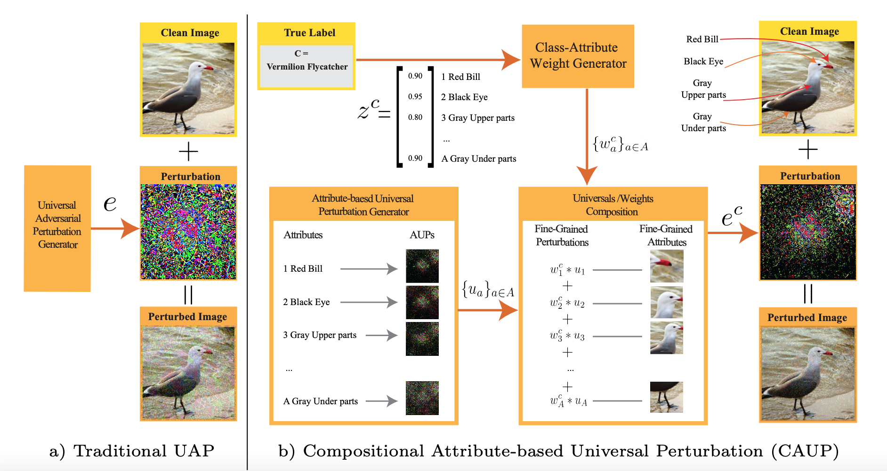

# Zero-Shot Attribute Attacks on Fine-Grained Recognition Models

## Overview
This repository contains the implementation of [Zero-Shot Attribute Attacks on Fine-Grained Recognition Models](https://link.springer.com/chapter/10.1007/978-3-031-20065-6_16).
> In this work, we propose to learn and compose multiple attribute-based universal perturbations(AUPs) to generate attacks that capture small differences between fine-grained classes, generalize well to previously unseen classes and can be applied in real-time,. Each AUP corresponds to an image-agnostic perturbation on a specific attribute. To build our attack, we compose AUPs with weights obtained by learning a class-attribute compatibility function . 



---
## Training and Testing 
To run the code:
```
bash run.sh
```
or
```
for norm in {"L2",}
do
	for dataset in {"CUB",}
	do
		CUDA_VISIBLE_DEVICES=1 python optimization_attack_dazlepp_test2.py --dataset $dataset --norm $norm
	done
done

---

## Citation
If you find the project helpful, we would appreciate if you cite the works:
```
@inproceedings{shafiee2022caup,
  title={Zero-Shot Attribute Attacks on Fine-Grained Recognition Models},
  author={Shafiee, Nasim and Elhamifar, Ehsan},
  booktitle={European Conference on Computer Vision},
  pages={262--282},
  year={2022},
  organization={Springer}
}

